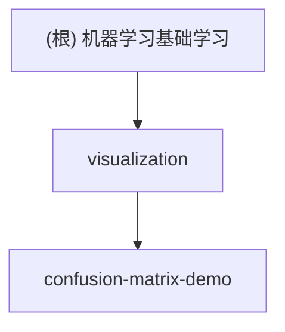

# 机器学习基础学习项目

## 项目愿景
本项目专注于机器学习基础概念的可视化教学，通过交互式演示帮助学习者深入理解混淆矩阵、分类性能指标（Precision、Recall、F1 Score）等核心概念。

## 架构总览
项目采用纯前端技术栈，通过HTML + JavaScript + Plotly.js构建交互式机器学习概念可视化平台。

### 模块结构图


## 模块索引

| 模块 | 路径 | 类型 | 职责描述 | 状态 |
|------|------|------|----------|------|
| confusion-matrix-demo | `./visualization/confusion-matrix-demo/` | HTML/JS | 混淆矩阵与分类指标的交互式演示 | 🟢 活跃 |

## 运行与开发

### 快速开始
```bash
# 直接在浏览器中打开演示页面
open index.html
```

### 本地开发
```bash
# 使用Python简单HTTP服务器
python -m http.server 8000
# 访问 http://localhost:8000
```

### 依赖管理
- Plotly.js (CDN): 2.24.1版本
- MathJax (CDN): 3.2.2版本
- 无需npm安装，纯CDN依赖

## 测试策略
- 浏览器兼容性测试
- 交互功能手动测试
- 响应式设计验证

## 编码规范
- 使用中文注释和界面
- 遵循ES6+语法规范
- CSS变量统一管理颜色
- 模块化的JavaScript函数设计

## AI使用指引
- 保持中文界面和注释
- 优先使用CDN依赖而非本地构建
- 注重教学可读性而非性能优化
- 维护现有的颜色编码系统

## 变更记录 (Changelog)

### 2025-11-21 19:22:05
- 初始化项目AI上下文
- 创建根级CLAUDE.md文档
- 识别核心可视化模块
- 我的项目是机器学习基础概念的可视化项目